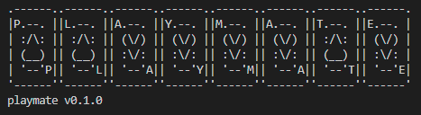

# Playmate

 [](https://twitter.com/un4gi_io)

<p align="center"></p>

Inspired by a [Securify blog post](https://www.securify.nl/blog/autorun-is-dead-long-live-autorun/), playmate is a CLI tool designed to automate the workflow of creating autoplay CDs for Penetration Testing or Red Team use.

Often for physical penetration tests or red team engagements, the need to insert a CD or USB for autoplay purposes will arise. This tool seeks to automate the boring part of creating the autorun CD in order to allow more time to be spent on the part that matters.

Use the "build" command to build an ISO containing an autorun file for the operating system of your choice. To get more information, use the "playmate build --help" command.

---

## Installation

For an easy installation, download the latest release for your operating system at <https://github.com/Un4gi/playmate/releases/>.

To install using Go, issue the following command:

```bash
go install github.com/un4gi/playmate@latest
```

To install from source (also requires Go):

```bash
git clone github.com/un4gi/playmate
cd playmate
go build .
```

### Windows Setup

To build an autoplay CD for Windows, you will first need to stage your payload in the "examples/windows" directory. At this time, only C++  payloads are supported.

The "examples/windows" directory currently includes:

- Two example payloads, "dwmapi-winexec.cpp" and "LaunchU3.cpp".
  - The "dwmapi-winexec.cpp" file will be used to create a .dll
  - The "LaunchU3.cpp" file can be used optionally as a launcher for the dll.
- An "autorun.inf" file containing directives for what actions will be available upon insertion of the CD.
- A "folder.ico" file, which will change the appearance of the icon in the autoplay menu when the CD is inserted into the target computer.

*Note that if you change the name of you payload, you will need to specify the new name using the "-d" and/or "-e" flags.*

### Linux Setup

To build an autoplay CD for Linux, you will only need a single file staged. An example is provided in the "examples/linux/autorun.sh" file. This file should contain the commands you wish to run on the target computer upon insertion of the CD. If you would like to deploy additional files with the "autorun.sh" file, you will need to modify the code accordingly, as this is not supported as an automated feature at this time (but may be implemented later).

---

## Usage

To use playmate, you will need to provide at minimum a source folder and a destination folder. The source folder is the location of your payload/autorun files. The destination folder is the location where you wish the ISO to be stored after creation.

> Example:

```bash
playmate build examples/linux /home/un4gi/Desktop
```

You can also supply various flags when building (currently for Windows only):
| Flag | Long flag | Description |
|------|-----------|-------------|
| -a | --arch | This specifies the architecture of the target system (x86/x64). |
| -d | --dll-name | This is the name of the dll to be compiled. This should match the name of your staged C++ (DLL) payload.
| -e | --exe-name | This is the name of the exe (launcher) to be compiled. This should match the name of your staged C++ launcher payload.
| -f | --format | This is the payload format you would like to compile. If you would like to build a standalone dll, choose "dll". If building a dll with an exe launcher, choose "exe". |

> Example:

```powershell
playmate build .\examples\windows C:\Users\un4gi\Desktop -a x64 --dll-name mydll --exe-name myexe -f exe
```

## References

- <https://www.securify.nl/blog/autorun-is-dead-long-live-autorun/>
- <https://github.com/securifybv/u3-armory>
